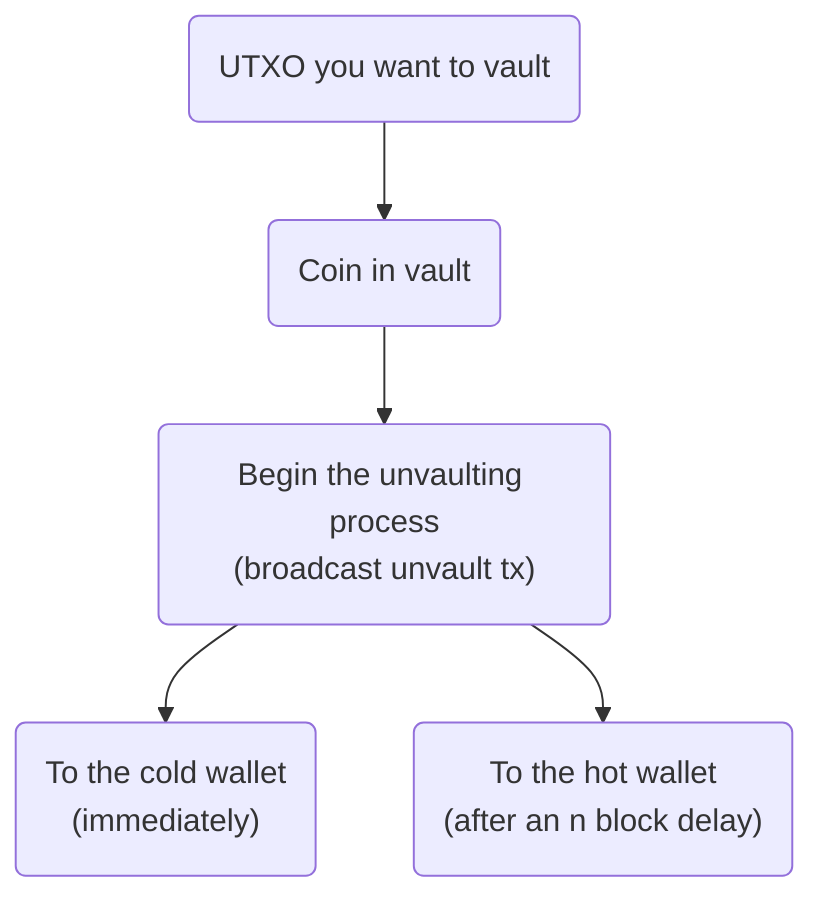
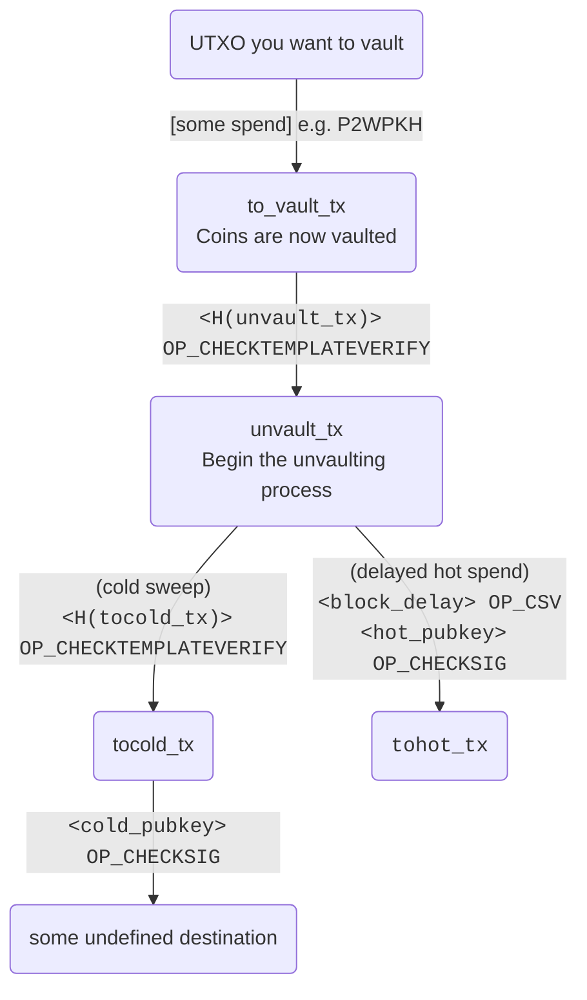

# Safer custody with CTV vaults

This repository demonstrates an implementation of simple, "single-hop" vaults
using the proposed `OP_CHECKTEMPLATEVERIFY` opcode. 

OP_CTV allows the vault strategy to be used without the need to maintain critical
presigned transaction data for the lifetime of the vault, as in the case of earlier
vault implementations. This approach is much simpler operationally, since all relevant
data aside from key material can be regenerated algorithmically. This makes vaulting
more practical at any scale.

The code included here is intended to be approachable and easy to read, though
it would need review and tweaking before use with real funds.



### Vault basics

*Vaulting* is a technique for putting constraints around how bitcoins can be spent.
The constraints are designed in such a way to limit the threat of failure 
(due to key loss or attempted confiscation) during the custody process. Vaults provide
safety improvements that are significant to both individuals performing self-custody
and institutions securing large amounts of bitcoin on behalf of their customers.

The basic idea of a vault is that you predetermine the path the coins in the vault
are allowed to travel, which lets you design the flow of funds so that you have
a chance to intervene in a known way if something unexpected
happens.

For example, in the basic "single-hop" vault structure implemented here, once a 
user vaults their coins, they can either unvault the balance to a key designated
as the "cold" wallet immediately, or they can begin the unvault process and, after a
block delay configurable by the user, spend the coins to a key designated as the
"hot" wallet.

This allows the user to intervene if they see that an unvault process
has been started unexpectedly: if an attacker Mallory gains control of the user Alice's hot wallet and wants to 
steal the vaulted coins, Mallory has to broadcast the unvault transaction. If Alice
is watching the mempool/chain, she will see that the unvault transaction has been
unexpectedly broadcast, and she can immediately sweep the balance to her cold wallet,
while Mallory must wait the block delay to succeed in stealing funds from the hot
wallet.


This scheme could also be adapted to limit trust in any particular hardware
vendor. Hardware vendor A could serve as the hot wallet, and some multisig combination
of vendors B and C could serve the more secure but less convenient "cold" role.


### Vault complexity 

Vaults can either be *limited* or *recursive*. In a recursive vault, the vault can
feed back into itself, potentially allowing the coins to remain in the vault after
an arbitrary number of steps or partial unvaultings.

The vault pattern implemented here is "limited" - it entails a single decision point, and atomically 
unvaults the entire value. Despite being limited, this still provides high utility 
for users. In fact, its simplicity may make it preferable to more complicated schemes.

## Demo

Now that we have background out of the way, let's actually build some vaults.
You can read through the following without actually running the code
yourself.

```sh
$ git clone https://github.com/jamesob/simple-ctv-vault
$ cd simple-ctv-vault
$ pip install -r requirements.txt

# build this bitcoin branch
#  https://github.com/JeremyRubin/bitcoin/tree/checktemplateverify-rebase-4-15-21
$ bitcoind -regtest -txindex=1 &
```

Okay, we're ready to go.

### Creating a vault

```sh
$ TXID=$(./main.py vault)
```


At this point, we've generated a coin on regtest and have spent it into a new vault.
`$TXID` corresponds to the transaction ID of the coin we spent into the vault,
which is the only piece of information we need to reconstruct the vault plan and
resume operations.

We've built a vault which looks like this:



When we create the vault, we encumber the coin with a `scriptPubKey` that looks like this:
```python
[unvault_ctv_hash, OP_CHECKTEMPLATEVERIFY]
```
where the first item is a hash of the tree of template transactions (basically, the 
tree illustrated above). 

#### Why CTV?

With today's consensus rules, the enforced flow of a vault is only possible if we
presign `tocold_tx` and `tohot_tx`, hang onto them, and then destroy the key. This
locks the spend path of the coins into the two prewritten transactions. But it saddles
us with the operational burden of persisting that critical data indefinitely. 

With large numbers of vaults, ensuring this durability becomes a challenge. And for
small-scale users, the data liability is yet another failure point during self-custody.

Key deletion during vault creation is also 
- hard to prove to auditors, and
- hard to prove to yourself.

Use of `OP_CHECKTEMPLATEVERIFY` allows us to use a covenant structure and avoid having
to rely on presigned transactions or ephemeral keys. With `<hash> OP_CTV`, we can
ensure that the vault operation is enforced by consensus itself, and the vault
transaction data can be generated deterministically without additional storage needs.

Other consensus change proposals can do this, but CTV is very simple and easy to reason
about.

### Unvaulting


When we initiate an unvault, we broadcast a transaction that satisfies the `OP_CTV`
script above; meaning that the transaction we broadcast has to CTV-hash to the value
cited (including outputs that possibly commit to subsequent CTV encumberances - hence
the tree). This doesn't require any signing, since the authentication is all in the
hash.

The script encumbering the unvault output looks something like
```python
def unvault_redeemScript(self) -> CScript:
    return CScript(
        [
            script.OP_IF,
                self.block_delay, script.OP_CHECKSEQUENCEVERIFY, script.OP_DROP,
                self.hot_pubkey.sec(), script.OP_CHECKSIG,
            script.OP_ELSE,
                self.tocold_ctv_hash, OP_CHECKTEMPLATEVERIFY,
        ]
    )
```
This ensures we have two choices: spend immediately to the cold wallet, or wait a few blocks and spend
to the hot wallet. Of course, more complicated unvault conditions could be written in
here.

### Detecting theft

This unvault step is critical because it allows us to detect unexpected behavior. If an attacker
had stolen our hot wallet keys, their only choice to succeed in the theft is to trigger an unvault.


We can monitor for such an event and respond by sweeping our keys to the cold wallet.


### Why does `tocold` make use of another CTV?

You'll notice that the hot-path requires signing with the hot private key to claim the funds. Because we
want to be able to respond immediately, and not have to dig out our cold private keys, we use an 
additional `OP_CTV` to encumber the "swept" coins for spending by only the cold wallet key.


### Spending to hot

Otherwise, if we've intentionally unvaulted, we wait for the timeout to elapse 
(`./main.py generate-blocks 10`), and then spend our funds with the hot wallet.


## Fee management

Because coins may remain vaulted for long periods of time, the unvault process is
sensitive to changes in the fee market. Because use of OP_CTV requires precommiting to
a tree of all possible specific outputs and the number of inputs, we cannot use RBF to
dynamically adjust feerate of unvaulting transactions.

In this implementation, we make use of [anchor outputs](https://bitcoinops.org/en/topics/anchor-outputs/)
in order to allow mummified unvault transactions to have their feerate adjusted dynamically.

```python
def p2wpkh_tx_template(...) -> CMutableTransaction:
    """Create a transaction template paying into a P2WPKH."""
    pay_to_script = CScript([script.OP_0, pay_to_h160])

    pay_to_fee_script = CScript([script.OP_0, fee_mgmt_pay_to_h160])
    HOPEFULLY_NOT_DUST: Sats = 550  # obviously TOOD?

    tx = CMutableTransaction()
    tx.nVersion = 2
    tx.vin = vin
    tx.vout = [
        CTxOut(nValue, pay_to_script),
        # Anchor output for CPFP-based fee bumps
        CTxOut(HOPEFULLY_NOT_DUST, pay_to_fee_script),
    ]
    return tx
```

### Fee key risk

One of the downsides of anchor outputs is that their use requires committing to the fee
address that is able to child-pays-for-parent (CPFP) fee bump the unvault transaction.
If the expected lifetime of a vault is for multiple years, ensuring that the fee
key isn't destroyed or compromised is an unfortunate obligation.

If the fee key were made unavailable for whatever reason, the unvaulting process would
be at the whim of the prevailing fee market during time of unvault. If the fee-bump
keys are lost and the fee market has gone well beyond the predetermined fee rate of the
unvault transaction, the coins basically become unredeemable without unearthing the
cold storage keys for a CPFP bump.

Note that this is not an inherent risk to vaults per se, but the specific method of 
using anchor outpoints for long-term vaults.

### Transaction sponsors

This points to the tension between covenants and fee management. As I noted in 
a [mailinglist post](https://lists.linuxfoundation.org/pipermail/bitcoin-dev/2022-February/019879.html), a 
fee management technique that doesn't require structural anticipation and chain-waste
like CPFP via anchor outputs would be most welcome. 
[Transaction sponsors](https://lists.linuxfoundation.org/pipermail/bitcoin-dev/2020-September/018168.html)
is an interesting approach.

Another possibility is to have a more granular sighash (like
[SIGHASH_GROUP](https://lists.linuxfoundation.org/pipermail/bitcoin-dev/2021-July/019243.html))
that allows vault transactions to be combined dynamically with fee-bump input/output
packages.

## Patterns for industrial users

One can imagine that large custodians of bitcoin might "tranche" up a vault pattern like
this into fixed sizes of bitcoin, and have on-demand unvaults that have block-delay
parameters compatible with their service-level agreements. This provides a good deal of
assurance that coin flows are safe and auditable while still remaining readily
liquid.


## Running tests

```sh
$ pip install pytest && pytest
```


## Prior work

- Vaults by kanzure: https://github.com/kanzure/python-vaults
- `OP_CTV` PR by JeremyRubin: https://utxos.org, https://github.com/bitcoin/bitcoin/pull/21702
- Vaults by JeremyRubin: https://rubin.io/bitcoin/2021/12/07/advent-10/ (and probably
  others)
