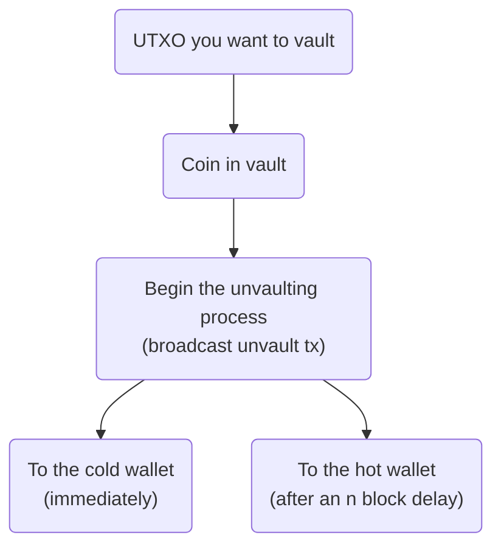
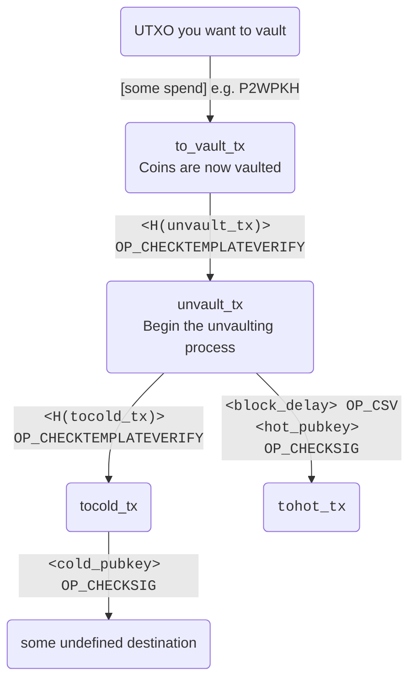

# Safer custody with CTV vaults

**Abstract:** This demonstrates an implementation of simple, "single-hop" vaults
using the proposed `OP_CHECKTEMPLATEVERIFY` opcode. 

OP_CTV allows the vault strategy
to be used without the need to maintain critical presigned transaction data for the lifetime of the vault, as in
the case of previous vault implementations. This
approach is much simpler operationally, since all relevant data aside from key
material can be regenerated algorithmically. This makes vaulting, which increases
custodial safety significantly, more practical at any scale.

The code included here is intended to be approachable and easy to read, though
it would probably need review and tweaking before real-world use. It should be
considered a toy in its current form.



### Vault basics

*Vaulting* is a technique for putting constraints around how bitcoins can be spent.
The constraints are designed in such a way to limit the threat of failure 
(due to key loss or attempted confiscation) during the custody process. Vaults provide
safety improvements that are significant to both individuals performing self-custody
and institutions securing large amounts of bitcoin on behalf of their customers.

The basic idea of a vault is that you predetermine the path the coins in the vault
are allowed to travel, which lets you design the flow of funds so that you have
a chance to intervene in a known way if something unexpected
happens.

For example, in the basic "single-hop" vault structure implemented here, once a 
user vaults their coins, they can either unvault the balance to a key designated
as the "cold" wallet immediately, or they can begin the unvault process and, after a
block delay configurable by the user, spend the coins to a key designated as the
"hot" wallet.

This allows the user to intervene if they see that an unvault process
has been started unexpectedly: if an attacker Mallory gains control of the user Alice's hot wallet and wants to 
steal the vaulted coins, Mallory has to broadcast the unvault transaction. If Alice
is watching the mempool/chain, she will see that the unvault transaction has been
unexpectedly broadcast, and she can immediately sweep the balance to her cold wallet,
while Mallory must wait the block delay to succeed in stealing funds.


### Vault complexity 

Vaults can either be *limited* or *recursive*. In a recursive vault, the vault can
feed back into itself, potentially allowing the coins to remain in the vault after
an arbitrary number of steps or partial unvaultings.

The vault pattern implemented here is "limited" - it entails a single decision point, and atomically 
unvaults the entire value. Despite being limited, this still provides high utility 
for users. In fact, its simplicity may make it preferable to more complicated schemes.

## Hands-on example

Now that we have the general stuff out of the way, let's actually build some vaults.
You can read through the following step-by-step without actually running the code
yourself.

```sh
$ git clone https://github.com/jamesob/simple-ctv-vault
$ cd simple-ctv-vault
$ pip install -r requirements.txt

# build this bitcoin branch
#  https://github.com/JeremyRubin/bitcoin/tree/checktemplateverify-rebase-4-15-21
$ bitcoind -regtest -txindex=1 &
```

Okay, we're ready to go.

### Creating a vault

```sh
$ TXID=$(./main.py vault)
```


At this point, we've generated a coin on regtest and have spent it into a new vault.
`$TXID` corresponds to the transaction ID of the coin we created the vault with,
which is the only piece of information we need to reconstruct the vault plan and
resume operations.

We've built a vault which looks like this:



This sort of enforced flow is currently only possible if we presign `tocold_tx` and `tohot_tx`,
ensure we hold onto the transaction data, and then destroy the key. This locks the spend path
of the coins into the two prewritten transactions, and saddles us with the operational burden
of persisting that critical data indefinitely.

Use of `OP_CHECKTEMPLATEVERIFY` allows us to use a covenant structure and avoid having to rely
on presigned transactions. With `<hash> OP_CTV`, we can ensure that *consensus itself* enforces all the
ways we can spend an output.

## Prior work
- Vaults by kanzure: https://github.com/kanzure/python-vaults
- `OP_CTV` PR by JeremyRubin: https://github.com/bitcoin/bitcoin/pull/21702
